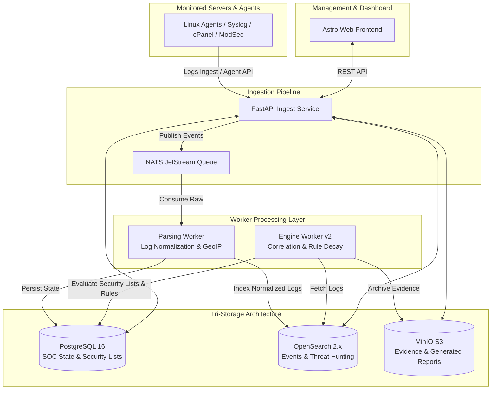

<h1 align="center">
  
  <br>
  SentinelX SIEM v2.0
</h1>

<p align="center">
  <b>A Lightweight, Scalable, Enterprise-Grade SIEM (Security Information and Event Management) for Modern Infrastructure & VPS Environments (cPanel/WHM Compatible).</b>
</p>

<p align="center">
  
  
  
  
  
  
  
</p>

<p align="center">
  <a href="#overview">Overview</a> •
  <a href="#features">Features</a> •
  <a href="#architecture">Architecture</a> •
  <a href="#quick-start">Quick Start</a> •
  <a href="#documentation">Documentation</a> •
  <a href="README_es.md">🇪🇸 Leer en Español</a>
</p>

---

## 🛡️ Overview

**SentinelX SIEM v2.0** is an enterprise-grade security intelligence and log correlation platform. Designed to ingest, parse, normalize, and correlate security logs across distributed Linux infrastructure, web servers, and control panels (cPanel/WHM, DirectAdmin).

It leverages a **tri-storage architecture**:
1. **PostgreSQL**: System state, multi-tenant RBAC, rules, security lists, alerts, incidents, reporting metadata.
2. **OpenSearch**: High-throughput log event storage, full-text searching, and threat hunting analytics.
3. **MinIO (S3 Object Storage)**: Immutable forensic evidence packages and generated SOC PDF/HTML reports.

Whether deployed on a standalone VPS, cPanel server, or distributed Docker stack, SentinelX provides deep SOC observability with a **single-command installer**.

---

## ✨ Key Features

- **🚀 1-Command Automated Installer (`setup_sentinelx.sh`)**: Idempotent setup for clean Linux VPS (Ubuntu/Debian/AlmaLinux/RHEL) and cPanel/WHM servers. Logged to `/var/log/sentinelx/install.log`.
- **🏗️ Tri-Storage Tiering**: Clear separation between PostgreSQL (SOC State), OpenSearch (Logs & Analytics), and MinIO (Forensic S3 Evidence & Reports).
- **🛡️ Centralized Dynamic Security Lists**: Frontend-managed Whitelists, Rule Exceptions, BlacklistMaster inventory (`shared`, `pmg`, `ignore`), and Reference Lists with in-memory TTL caching and forensic ignore logs.
- **⚡ Asynchronous Ingest & Correlation Engine**: Decoupled `parsing_worker` and `engine_worker` loops running on NATS JetStream queues.
- **🌍 GeoIP & Behavioral Risk Scoring**: Enriches events with GeoIP location, ASN mapping, time-decay scoring, and entity tracking.
- **📊 SOC Reporting & Maintenance Engine**: Automated weekly/monthly/quarterly executive PDF/HTML report generation, S3 storage, and retention purge policies.
- **⚙️ Dedicated Systemd & cPanel Coexistence**: Operates cleanly under `/opt/sentinelx` with non-conflicting reserved ports (`8000`, `4321`, `5432`, `9200`, `9000`, `4222`).

---

## 🏗️ Enterprise Architecture v2.0



---

## ⚡ Quick Start (Clean VPS / cPanel Install)

### 1. Clone the Repository
```bash
git clone https://github.com/caap1234/SIEM-SentinelXv2.0.git /opt/sentinelx
cd /opt/sentinelx
```

### 2. Run the Production Installer
```bash
chmod +x setup_sentinelx.sh
./setup_sentinelx.sh
```

**What the installer does automatically**:
1. Detects OS and installs system requirements.
2. Checks cPanel/WHM and configures CSF Firewall rules (`DOCKER="1"`).
3. Generates secure `.env` configuration file (`chmod 600`).
4. Creates Python `.venv` and builds Astro frontend static assets.
5. Runs `scripts/initial_setup.py` (Alembic DB migrations, admin account setup, MinIO bucket creation, OpenSearch indices, and security list seeds).
6. Registers Systemd services (`sentinelx-api`, `sentinelx-worker`, `sentinelx-ingest`, `sentinelx-frontend`).

---

## 📚 Documentation & Guides

Comprehensive technical documentation is available in the [`docs/`](docs/) directory:

- 📖 **[Installation Guide](docs/INSTALLATION_GUIDE.md)**: Hardware requirements, port matrix, step-by-step VPS/cPanel installation, and troubleshooting.
- 📋 **[Deployment Checklist](docs/DEPLOYMENT_CHECKLIST.md)**: Pre-production verification list.
- 🤖 **[Linux Agent Installation Guide](docs/AGENT_INSTALLATION.md)**: 1-line installation script and configuration for monitored client nodes.
- 📋 **[Security List Architecture Design](docs/LIST_MANAGEMENT_DESIGN.md)**: Dynamic whitelists, rule exceptions, and BlacklistMaster integration.
- 📑 **[SOC Reporting Architecture](docs/REPORTING_DESIGN.md)**: Executive/operational PDF & HTML report generation and retention policies.

---

## 🤝 System Verification & Testing

SentinelX includes an extensive test suite verifying end-to-end SOC flow, security list precedence, and API integrity:

```bash
# Run backend unit test suite (91 tests)
DATABASE_URL="sqlite:///:memory:" .venv/bin/pytest tests/unit/ -v

# Build frontend static assets
npm run build --prefix front
```

---

## 📄 License

This project is licensed under the open-source License. See [LICENSE](LICENSE) for details.
