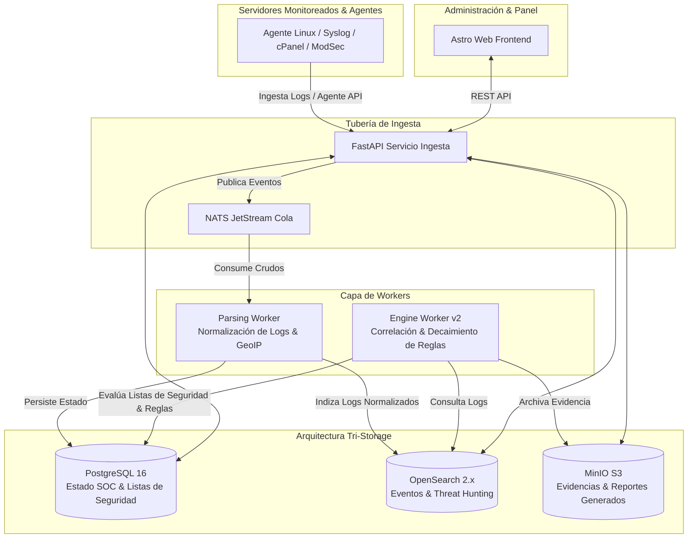

<h1 align="center">
  
  <br>
  SentinelX SIEM v2.0
</h1>

<p align="center">
  <b>Plataforma SIEM (Security Information and Event Management) Ligera, Escalable y de Grado Empresarial para Infraestructura Moderna y Servidores VPS (Compatible con cPanel/WHM).</b>
</p>

<p align="center">
  
  
  
  
  
  
  
</p>

<p align="center">
  <a href="#descripción">Descripción</a> •
  <a href="#características">Características</a> •
  <a href="#arquitectura-empresarial-v20">Arquitectura</a> •
  <a href="#quick-start-instalación-en-vps--cpanel">Quick Start</a> •
  <a href="#documentación-y-guías">Documentación</a> •
  <a href="README.md">🇬🇧 Read in English</a>
</p>

---

## 🛡️ Descripción

**SentinelX SIEM v2.0** es una plataforma de inteligencia de seguridad y correlación de eventos en tiempo real de nivel empresarial. Diseñada para ingestar, parsear, normalizar y correlacionar logs de seguridad en infraestructuras Linux distribuidas, servidores web y paneles de control (cPanel/WHM, DirectAdmin).

Implementa una **arquitectura de tri-almacenamiento (Tri-Storage)**:
1. **PostgreSQL**: Estado del sistema, RBAC multi-tenant, reglas, listas de seguridad, alertas, incidentes y metadatos de reportes.
2. **OpenSearch**: Ingesta masiva de logs a alta velocidad, búsqueda de texto completo y analítica para Threat Hunting.
3. **MinIO (Almacenamiento de Objetos S3)**: Paquetes inmutables de evidencia forense y reportes ejecutivos/operativos generados en PDF y HTML.

Ya sea desplegado en un VPS dedicado, en un servidor con cPanel/WHM o mediante contenedores Docker, SentinelX proporciona visibilidad profunda con un **instalador automatizado de un solo comando**.

---

## ✨ Características Principales

- **🚀 Instalador Automatizado (`setup_sentinelx.sh`)**: Instalación idempotente para VPS Linux limpios (Ubuntu/Debian/AlmaLinux/RHEL) y servidores cPanel/WHM. Registra el proceso en `/var/log/sentinelx/install.log`.
- **🏗️ Tri-Almacenamiento por Capas**: Separación clara entre PostgreSQL (Estado SOC), OpenSearch (Logs y Analítica) y MinIO (Evidencias S3 y Reportes).
- **🛡️ Sistema Centralizado de Listas de Seguridad**: Whitelists administrables desde Frontend, Excepciones por Regla, inventario BlacklistMaster (`shared`, `pmg`, `ignore`) y Listas de Referencia con caché TTL en memoria y trazabilidad forense de eventos ignorados.
- **⚡ Motor Asíncrono de Ingesta y Correlación**: Workers desacoplados (`parsing_worker` y `engine_worker`) comunicados mediante colas NATS JetStream.
- **🌍 GeoIP y Puntuación de Riesgo**: Enriquecimiento automático de eventos con ubicación GeoIP, mapeo ASN, decaimiento temporal y seguimiento de comportamiento de entidades.
- **📊 Motor de Mantenimiento y Reportes SOC**: Generación programada u bajo demanda de reportes ejecutivos/operativos en PDF y HTML, almacenamiento en MinIO S3 y políticas de retención.
- **⚙️ Servicios Systemd y Coexistencia con cPanel**: Operación aislada en `/opt/sentinelx` utilizando puertos dedicados que no interfieren con cPanel (`8000`, `4321`, `5432`, `9200`, `9000`, `4222`).

---

## 🏗️ Arquitectura Empresarial v2.0



---

## ⚡ Quick Start (Instalación en VPS / cPanel)

### 1. Clonar el Repositorio
```bash
git clone https://github.com/caap1234/SIEM-SentinelXv2.0.git /opt/sentinelx
cd /opt/sentinelx
```

### 2. Ejecutar el Instalador de Producción
```bash
chmod +x setup_sentinelx.sh
./setup_sentinelx.sh
```

**¿Qué realiza el instalador de forma automática?**:
1. Detecta el SO e instala paquetes requeridos.
2. Verifica la presencia de cPanel/WHM y ajusta reglas de Firewall CSF (`DOCKER="1"`).
3. Genera un archivo `.env` de producción seguro con permisos restringidos (`chmod 600`).
4. Configura el entorno virtual `.venv` de Python y construye los archivos estáticos de Astro.
5. Ejecuta `scripts/initial_setup.py` (migraciones Alembic, usuario administrador inicial, bucket MinIO, índices OpenSearch y listas de seguridad).
6. Registra y activa las unidades de servicio Systemd (`sentinelx-api`, `sentinelx-worker`, `sentinelx-ingest`, `sentinelx-frontend`).

---

## 📚 Documentación y Guías

Consulte la documentación técnica completa dentro del directorio [`docs/`](docs/):

- 📖 **[Guía de Instalación y Despliegue](docs/INSTALLATION_GUIDE.md)**: Requisitos de hardware, matriz de puertos, pasos detallados para VPS y cPanel, e instrucciones de resolución de problemas.
- 📋 **[Checklist Pre-Despliegue a Producción](docs/DEPLOYMENT_CHECKLIST.md)**: Lista de verificación antes del pase a producción.
- 🤖 **[Guía de Instalación del Agente Linux](docs/AGENT_INSTALLATION.md)**: Script de instalación en un solo paso y configuración para nodos cliente monitoreados.
- 📋 **[Diseño de Listas de Seguridad Centralizadas](docs/LIST_MANAGEMENT_DESIGN.md)**: Whitelists dinámicas, excepciones por regla e integración con BlacklistMaster.
- 📑 **[Arquitectura de Reportes SOC](docs/REPORTING_DESIGN.md)**: Generación de reportes ejecutivos/operativos en PDF y HTML y políticas de retención.

---

## 🤝 Verificación y Pruebas del Sistema

SentinelX incluye una suite de pruebas que valida el flujo SOC de extremo a extremo, la precedencia de listas de seguridad y la integridad de la API REST:

```bash
# Ejecutar suite de pruebas unitarias del backend (91 pruebas)
DATABASE_URL="sqlite:///:memory:" .venv/bin/pytest tests/unit/ -v

# Compilar assets estáticos del frontend
npm run build --prefix front
```

---

## 📄 Licencia

Este proyecto es código abierto. Consulte el archivo [LICENSE](LICENSE) para obtener más detalles.
