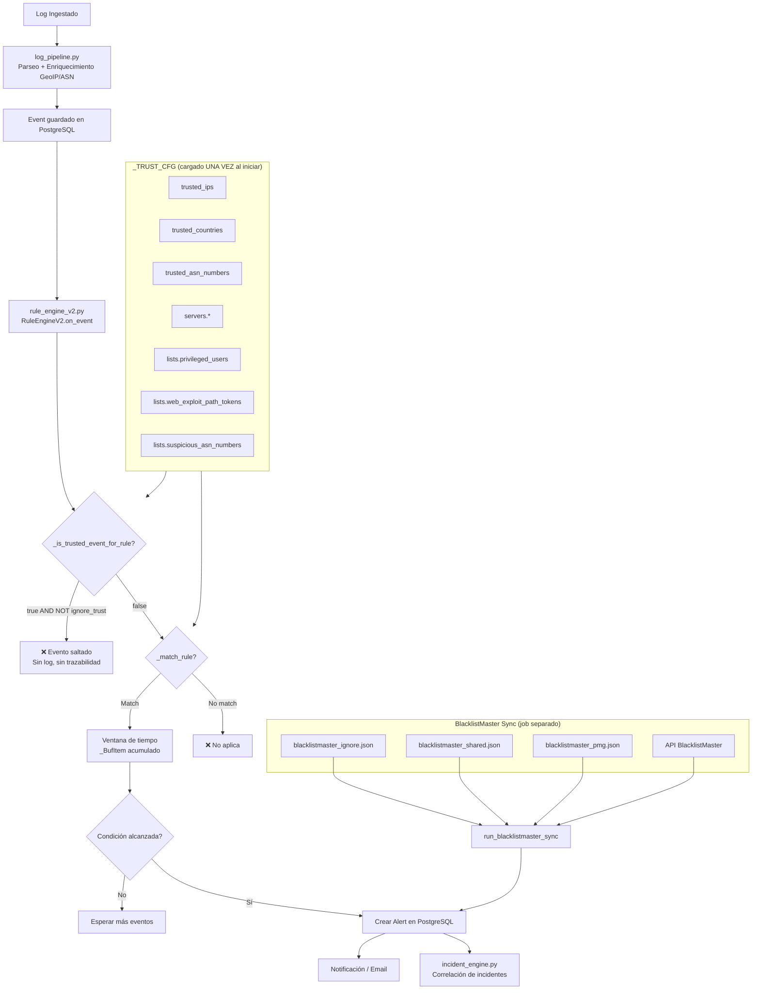

# LIST_MANAGEMENT_DESIGN.md
# Revisión Arquitectónica: Sistema de Listas de Seguridad — SentinelX SIEM

> **Fecha:** 2026-08-10  
> **Estado:** ANÁLISIS (sin cambios al código)  
> **Tipo:** Revisión arquitectónica previa a implementación

---

## Tabla de Contenidos

1. [Diagnóstico del Estado Actual](#1-diagnóstico-del-estado-actual)
2. [Flujo de Datos y Pipeline de Detección](#2-flujo-de-datos-y-pipeline-de-detección)
3. [Análisis de Cada Archivo de Configuración](#3-análisis-de-cada-archivo-de-configuración)
4. [Riesgos Actuales](#4-riesgos-actuales)
5. [Propuesta Arquitectónica: Evolución Dinámica](#5-propuesta-arquitectónica-evolución-dinámica)
6. [Modelo de Datos PostgreSQL](#6-modelo-de-datos-postgresql)
7. [APIs Necesarias](#7-apis-necesarias)
8. [Control RBAC y Auditoría](#8-control-rbac-y-auditoría)
9. [Diseño de Interfaz Frontend](#9-diseño-de-interfaz-frontend)
10. [Plan de Migración por Fases](#10-plan-de-migración-por-fases)
11. [Archivos a Modificar](#11-archivos-a-modificar)

---

## 1. Diagnóstico del Estado Actual

### 1.1 Resumen de los Archivos de Configuración Existentes

| Archivo | Propósito | Consumido por |
|---------|-----------|--------------|
| `app/config/trust_list.json` | IPs confiables, países, ASN, servidores, listas de detección | `rule_engine_v2.py` (a través de `SIEM_TRUST_CONFIG_PATH`) |
| `app/config/blacklistmaster_ignore.json` | IPs/CIDRs a ignorar en sincronización BlacklistMaster | `blacklistmaster_sync.py::_load_ignore_list()` |
| `app/config/blacklistmaster_shared.json` | Inventario de servidores shared hosting | `blacklistmaster_sync.py::_load_inventory_map()` |
| `app/config/blacklistmaster_pmg.json` | Inventario de servidores relay/PMG de correo | `blacklistmaster_sync.py::_load_inventory_map()` |

---

### 1.2 Cómo se Cargan las Listas

#### Trust List (`trust_list.json`)

```python
# app/services/rule_engine_v2.py — líneas 30-51
def _read_trust_config() -> Dict[str, Any]:
    # Prioridad 1: Variable de entorno SIEM_TRUST_CONFIG_JSON (JSON inline)
    raw = (os.getenv("SIEM_TRUST_CONFIG_JSON") or "").strip()
    if raw:
        return json.loads(raw)  # ← Carga en memoria al importar el módulo

    # Prioridad 2: Ruta de archivo vía SIEM_TRUST_CONFIG_PATH
    path = (os.getenv("SIEM_TRUST_CONFIG_PATH") or "").strip()
    if path:
        return json.load(open(path))

    # Sin variables de entorno: retorna {} (lista vacía → NO funciona)
    return {}

_TRUST_CFG: Dict[str, Any] = _read_trust_config()  # Cargado UNA VEZ al inicio
```

> [!CAUTION]
> **PROBLEMA CRÍTICO**: Si no existen las variables de entorno `SIEM_TRUST_CONFIG_JSON` ni `SIEM_TRUST_CONFIG_PATH`, `_TRUST_CFG` es `{}` y TODAS las listas quedan vacías.  
> El archivo `app/config/trust_list.json` **NO se carga automáticamente** — solo se carga si `SIEM_TRUST_CONFIG_PATH` apunta explícitamente a él.  
> Actualmente ningún `.env` ni `.env.example` tiene estas variables configuradas.

#### BlacklistMaster Files

```python
# app/services/blacklistmaster_sync.py — líneas 273-280
def run_blacklistmaster_sync():
    config_dir = Path(__file__).resolve().parents[1] / "config"
    shared_path = config_dir / "blacklistmaster_shared.json"  # ← Hardcoded
    pmg_path    = config_dir / "blacklistmaster_pmg.json"     # ← Hardcoded
    ignore_path = config_dir / "blacklistmaster_ignore.json"  # ← Hardcoded

    shared_map = _load_inventory_map(shared_path)
    pmg_map    = _load_inventory_map(pmg_path)
    ignore     = _load_ignore_list(ignore_path)
```

Estos sí funcionan porque las rutas son hardcoded relativas al directorio del módulo.

---

### 1.3 En qué Punto del Pipeline se Aplican

```
INGESTIÓN (log_pipeline.py)
    ↓
    [SIN filtros de trust/blacklist aquí]
    
NORMALIZACIÓN / PARSING (parsers/*.py)
    ↓
    [SIN filtros de trust/blacklist aquí]
    
DETECCIÓN (rule_engine_v2.py) ← AQUÍ SE APLICAN LAS LISTAS
    ↓
    ┌─ _is_trusted_event()    ← trust_list: IPs, países, ASN, servidores
    ├─ _match_rule()          ← trust_list.lists: in_ref, contains_any_ref
    └─ _is_ignored_ip()       ← blacklistmaster_ignore.json (solo en sync BLM)
    
GENERACIÓN DE ALERTA (rule_engine_v2.py)
    ↓
    Si is_trusted_event AND NOT ignore_trust → se SALTA la regla (no genera alerta)
    
CORRELACIÓN (incident_engine.py)
    ↓
    [SIN acceso directo a trust lists]
```

---

### 1.4 Qué Consultan las Reglas en las Listas

Las reglas definen referencias a listas en el campo `match` usando:

| Operador | Ejemplo en regla | Lista consultada |
|----------|-----------------|-----------------|
| `in_ref` | `"username": {"in_ref": "privileged_users"}` | `trust_list.json → lists.privileged_users` |
| `in_ref` | `"extra.asn.number": {"in_ref": "suspicious_asn_numbers"}` | `trust_list.json → lists.suspicious_asn_numbers` |
| `contains_any_ref` | `"extra.http.path": {"contains_any_ref": "web_exploit_path_tokens"}` | `trust_list.json → lists.web_exploit_path_tokens` |
| `contains_any_ref` | `"extra.http.path": {"contains_any_ref": "sensitive_path_keywords"}` | `trust_list.json → lists.sensitive_path_keywords` |
| `contains_any_ref` | `"extra.http.path": {"contains_any_ref": "phishing_path_keywords"}` | `trust_list.json → lists.phishing_path_keywords` |

#### Reglas que usan trust_list.lists

| Regla | Lista usada | Tipo |
|-------|------------|------|
| `AUTH-006` — Privileged login from new IP | `privileged_users` | `in_ref` |
| `WEB-XXX` — Web exploit path tokens | `web_exploit_path_tokens` | `contains_any_ref` |
| `WEB-XXX` — Sensitive path access | `sensitive_path_keywords` | `contains_any_ref` |
| `WEB-XXX` — Phishing path keywords | `phishing_path_keywords` | `contains_any_ref` |
| `NET-XXX` — Suspicious ASN | `suspicious_asn_numbers` | `in_ref` |

---

### 1.5 Trazabilidad Actual de Eventos Ignorados

| Sistema | ¿Existe trazabilidad? | Detalle |
|---------|-----------------------|---------|
| Trust List (global) | ❌ No | Cuando `_is_trusted_event()` devuelve `True`, el evento se salta sin log |
| Trust List (per-rule) | ❌ No | Mismo comportamiento |
| BlacklistMaster ignore | ⚠️ Parcial | El sync reporta `ignored_ips: N` en el retorno JSON del job, pero no persiste por IP |
| `rule_engine_v2.py` | ❌ No | No tiene `import logging` — cero trazabilidad en detección |

---

## 2. Flujo de Datos y Pipeline de Detección



---

## 3. Análisis de Cada Archivo de Configuración

### 3.1 `trust_list.json`

| Sección | Función | Estado |
|---------|---------|--------|
| `trusted_ips` | IPs que nunca generan alertas | ✅ Funcional SI se configura la env var |
| `trusted_countries` | Países exentos de alertas (global) | ✅ Funcional |
| `trusted_asn_numbers` | ASNs exentos de alertas | ✅ Funcional |
| `servers.*` | IPs de servidores propios exentos | ✅ Funcional |
| `lists.phishing_host_tokens` | Lista para reglas de phishing | ⚠️ Definida pero ninguna regla la usa con `in_ref` actualmente |
| `lists.phishing_path_keywords` | Keywords en paths de phishing | ✅ Usada por reglas WEB |
| `lists.suspicious_file_exts` | Extensiones sospechosas | ⚠️ Definida pero no referenciada en reglas seed |
| `lists.sensitive_path_keywords` | Rutas sensibles | ✅ Usada por reglas WEB |
| `lists.web_exploit_path_tokens` | Tokens de exploit en URL | ✅ Usada por reglas WEB |
| `lists.privileged_users` | Usuarios con acceso privilegiado | ✅ Usada por AUTH-006 |
| `lists.suspicious_asn_numbers` | ASNs sospechosos para detección | ✅ Usada por reglas NET |
| `lists.suspicious_asn_org_tokens` | Organizaciones ASN sospechosas | ⚠️ Definida pero no referenciada en reglas seed |

### 3.2 `blacklistmaster_ignore.json`

- **Propósito**: Evitar falsos positivos en el sync de BlacklistMaster.
- **Funciona**: Sí, se carga en `run_blacklistmaster_sync()` y se verifica con `_is_ignored_ip()`.
- **Limitación**: No tiene soporte CIDR desde env var (`BLACKLISTMASTER_IGNORE_CIDRS` solo acepta formato CSV, puede fallar con subredes grandes).
- **Sin trazabilidad**: No se registra qué IP fue ignorada y cuándo.

### 3.3 `blacklistmaster_shared.json`

- **Propósito**: Clasificar IPs listadas en RBL como "shared hosting" (severidad 28) en lugar de "dedicated" (severidad 14).
- **Funciona**: Sí. El cliente HTTP consulta la API de BlacklistMaster, y si la IP está en este mapa, se clasifica como `BLM-002`.
- **Aplica a**: IPs — no dominios, no correo.
- **CRUD desde frontend**: Altamente recomendado (ver Fase 2).

### 3.4 `blacklistmaster_pmg.json`

- **Propósito**: Clasificar IPs como relays PMG (Proxmox Mail Gateway) con severidad 26.
- **Funciona**: Igual que `shared`.
- **Aplica a**: IPs de servidores de correo relay.
- **CRUD desde frontend**: Altamente recomendado.

---

## 4. Riesgos Actuales

### 🔴 Riesgo Crítico

| # | Riesgo | Impacto | Descripción |
|---|--------|---------|-------------|
| R1 | **Trust List NO activa por defecto** | Alto | Sin `SIEM_TRUST_CONFIG_PATH` en el `.env`, `_TRUST_CFG = {}` → ninguna IP/ASN/país es confiable → pueden generarse falsos positivos masivos |
| R2 | **Sin trazabilidad de eventos ignorados** | Alto | Cuando un evento se descarta por trust, no hay log, no hay registro en BD → imposible auditar |
| R3 | **`lists.phishing_host_tokens`** no usada | Medio | El archivo define tokens de phishing por host, pero ninguna regla actual los referencia vía `in_ref` |

### 🟡 Riesgo Medio

| # | Riesgo | Impacto | Descripción |
|---|--------|---------|-------------|
| R4 | **Recarga requiere restart** | Medio | `_TRUST_CFG` se carga al importar el módulo. Cambiar el JSON no tiene efecto hasta reiniciar el proceso |
| R5 | **Sin versionado de listas** | Medio | No hay historial de cambios. Si una IP se agrega/elimina por error, no hay rollback |
| R6 | **Sin soporte multi-tenant** | Medio | Las listas son globales. No es posible tener excepciones por tenant |
| R7 | **Sin expiración temporal** | Bajo-Medio | Una excepción temporal (server de monitoreo) nunca expira automáticamente |

### 🟢 Riesgo Bajo

| # | Riesgo | Descripción |
|---|--------|-------------|
| R8 | Duplicación IP en `trust_list.json` y `blacklistmaster_ignore.json` | La misma IP puede estar en ambos sin coordinación |
| R9 | Sin validación de formato | No hay validación de CIDRs/IPs al editar el JSON manualmente |

---

## 5. Propuesta Arquitectónica: Evolución Dinámica

### Principios de Diseño

1. **Migración no destructiva**: Los JSON actuales siguen funcionando como fallback.
2. **PostgreSQL = fuente de verdad** para listas administrables.
3. **Caché en memoria** para rendimiento (TTL configurable).
4. **Multi-tenant**: Global → Tenant → Por regla (precedencia en cascada).
5. **Auditoría**: Cada cambio tiene autor, fecha, motivo y registro de expiración.
6. **Sin duplicar eventos**: Las listas complementan el pipeline, no replican logs.

### Arquitectura en Capas

```
┌─────────────────────────────────────────────────────────────────┐
│  FRONTEND (Astro)                                               │
│  /dashboard/listas — CRUD con búsqueda, importación, historial  │
└────────────────────────┬────────────────────────────────────────┘
                         │ API REST
┌────────────────────────▼────────────────────────────────────────┐
│  BACKEND (FastAPI) — /api/v1/lists/*                            │
│  ├── ListsRouter (CRUD)                                         │
│  ├── ListCacheService (caché en memoria, TTL)                   │
│  └── AuditService (registro de cambios)                         │
└────────────────────────┬────────────────────────────────────────┘
                         │
┌────────────────────────▼────────────────────────────────────────┐
│  POSTGRESQL                                                     │
│  ├── security_list_entries  (entradas individuales)             │
│  ├── security_list_audit    (historial de cambios)              │
│  └── security_list_expirations (expiración automática)          │
└────────────────────────┬────────────────────────────────────────┘
                         │ Caché en memoria
┌────────────────────────▼────────────────────────────────────────┐
│  RULE ENGINE (rule_engine_v2.py)                                │
│  ├── _is_trusted_event()  ← consulta caché (no PostgreSQL)      │
│  ├── _match_rule()        ← consulta caché para in_ref/contains_any_ref
│  └── _log_ignored_event() ← NUEVO: trazabilidad                 │
└─────────────────────────────────────────────────────────────────┘
```

---

## 6. Modelo de Datos PostgreSQL

### Tabla Principal: `security_list_entries`

```sql
CREATE TABLE security_list_entries (
    id              BIGSERIAL PRIMARY KEY,
    tenant_id       VARCHAR(100)  NOT NULL DEFAULT 'global',  -- 'global' | tenant específico
    list_type       VARCHAR(50)   NOT NULL,    -- 'whitelist_ip' | 'blacklist_ip' | 'exception_rule' | 
                                               -- 'trusted_country' | 'trusted_asn' | 'list_ref' | 
                                               -- 'blm_ignore' | 'blm_shared' | 'blm_pmg'
    value           VARCHAR(500)  NOT NULL,    -- La IP, CIDR, ASN, país, token, etc.
    value_type      VARCHAR(30)   NOT NULL,    -- 'ip' | 'cidr' | 'asn' | 'country_code' | 'token' | 'username'
    list_name       VARCHAR(100)  NULL,        -- Para list_type='list_ref': nombre de la lista (ej. 'privileged_users')
    rule_code       VARCHAR(50)   NULL,        -- Para excepciones específicas por regla (ej. 'AUTH-006')
    reason          TEXT          NULL,        -- Motivo del registro
    enabled         BOOLEAN       NOT NULL DEFAULT TRUE,
    expires_at      TIMESTAMPTZ   NULL,        -- NULL = nunca expira
    created_by      VARCHAR(200)  NOT NULL,
    created_at      TIMESTAMPTZ   NOT NULL DEFAULT NOW(),
    updated_by      VARCHAR(200)  NULL,
    updated_at      TIMESTAMPTZ   NULL,
    
    UNIQUE (tenant_id, list_type, value, rule_code)
);

-- Índices para búsqueda rápida en caché y en queries de detección
CREATE INDEX idx_sle_type_tenant  ON security_list_entries (list_type, tenant_id);
CREATE INDEX idx_sle_value        ON security_list_entries (value);
CREATE INDEX idx_sle_list_name    ON security_list_entries (list_name);
CREATE INDEX idx_sle_rule_code    ON security_list_entries (rule_code);
CREATE INDEX idx_sle_expires_at   ON security_list_entries (expires_at) WHERE expires_at IS NOT NULL;
CREATE INDEX idx_sle_enabled      ON security_list_entries (enabled) WHERE enabled = TRUE;
```

### Tabla de Auditoría: `security_list_audit`

```sql
CREATE TABLE security_list_audit (
    id              BIGSERIAL PRIMARY KEY,
    entry_id        BIGINT        NOT NULL REFERENCES security_list_entries(id) ON DELETE CASCADE,
    action          VARCHAR(20)   NOT NULL,  -- 'create' | 'update' | 'delete' | 'enable' | 'disable'
    field_changed   VARCHAR(100)  NULL,      -- Qué campo cambió (ej. 'expires_at', 'enabled')
    old_value       TEXT          NULL,
    new_value       TEXT          NULL,
    performed_by    VARCHAR(200)  NOT NULL,
    performed_at    TIMESTAMPTZ   NOT NULL DEFAULT NOW(),
    ip_address      VARCHAR(50)   NULL,
    reason          TEXT          NULL
);

CREATE INDEX idx_sla_entry_id    ON security_list_audit (entry_id);
CREATE INDEX idx_sla_performed_at ON security_list_audit (performed_at DESC);
CREATE INDEX idx_sla_performed_by ON security_list_audit (performed_by);
```

### Tabla de Trazabilidad: `security_list_ignore_log`

```sql
-- Trazabilidad de cuándo una IP/evento fue ignorado por la trust list
CREATE TABLE security_list_ignore_log (
    id              BIGSERIAL PRIMARY KEY,
    tenant_id       VARCHAR(100)  NOT NULL,
    ignore_reason   VARCHAR(100)  NOT NULL,  -- 'trusted_ip' | 'trusted_country' | 'trusted_asn' | 
                                             -- 'blm_ignore' | 'rule_exception' | 'non_global_ip'
    value_matched   VARCHAR(500)  NOT NULL,  -- La IP/ASN/país que hizo match
    rule_code       VARCHAR(50)   NULL,
    event_id        UUID          NULL,      -- Referencia al event de PostgreSQL
    source          VARCHAR(100)  NULL,      -- exim, apache, etc.
    server          VARCHAR(200)  NULL,
    ip_client       VARCHAR(50)   NULL,
    logged_at       TIMESTAMPTZ   NOT NULL DEFAULT NOW()
);

-- IMPORTANTE: Esta tabla tiene retención automática de 90 días
CREATE INDEX idx_slil_tenant_logged ON security_list_ignore_log (tenant_id, logged_at DESC);
CREATE INDEX idx_slil_ip_client     ON security_list_ignore_log (ip_client);
CREATE INDEX idx_slil_logged_at     ON security_list_ignore_log (logged_at DESC);
```

### Valores de `list_type` y sus Equivalentes Actuales

| `list_type` | Equivalente JSON actual | Descripción |
|-------------|------------------------|-------------|
| `whitelist_ip` | `trust_list.trusted_ips` | IP global exenta de alertas |
| `whitelist_cidr` | `blacklistmaster_ignore.cidrs` | Rango CIDR exento |
| `trusted_country` | `trust_list.trusted_countries` | País exento |
| `trusted_asn` | `trust_list.trusted_asn_numbers` | ASN exento |
| `trusted_server_ip` | `trust_list.servers.*` | IP de servidor propio |
| `exception_rule` | `rule.emit.trusted_ips_extra` | Excepción para una regla específica |
| `list_ref` | `trust_list.lists.*` | Entrada en una lista de referencia (privileged_users, etc.) |
| `blm_ignore` | `blacklistmaster_ignore.ips` | IP a ignorar en sync BlacklistMaster |
| `blm_shared` | `blacklistmaster_shared.servers` | Servidor de shared hosting |
| `blm_pmg` | `blacklistmaster_pmg.servers` | Servidor relay PMG |
| `suspicious_asn` | `trust_list.lists.suspicious_asn_numbers` | ASN sospechoso para detección |
| `suspicious_token` | `trust_list.lists.web_exploit_path_tokens` | Token de exploit para detección |

---

## 7. APIs Necesarias

### Endpoint Base: `/api/v1/lists`

```
GET    /api/v1/lists                        # Listar entradas (filtros: type, tenant, list_name, rule_code)
POST   /api/v1/lists                        # Crear entrada
GET    /api/v1/lists/{id}                   # Detalle de una entrada
PUT    /api/v1/lists/{id}                   # Actualizar entrada
DELETE /api/v1/lists/{id}                   # Eliminar entrada
PATCH  /api/v1/lists/{id}/toggle            # Activar/desactivar
GET    /api/v1/lists/{id}/audit             # Historial de cambios de una entrada
GET    /api/v1/lists/audit                  # Historial global de cambios
POST   /api/v1/lists/import                 # Importar desde JSON (compatibilidad con archivos existentes)
GET    /api/v1/lists/export                 # Exportar como JSON
GET    /api/v1/lists/ignore-log             # Trazabilidad de eventos ignorados
GET    /api/v1/lists/types                  # Catálogo de list_types disponibles
POST   /api/v1/lists/cache/refresh          # Forzar recarga de caché en memoria (admin)
```

### Esquema de Entrada (Request Body — `POST /api/v1/lists`)

```json
{
  "tenant_id": "global",
  "list_type": "whitelist_ip",
  "value": "192.168.1.100",
  "value_type": "ip",
  "reason": "Servidor de monitoreo autorizado - Zabbix",
  "expires_at": "2026-12-31T00:00:00Z",
  "rule_code": null
}
```

### Esquema de Respuesta (GET con filtros)

```json
{
  "total": 42,
  "entries": [
    {
      "id": 1,
      "tenant_id": "global",
      "list_type": "whitelist_ip",
      "value": "192.168.1.100",
      "value_type": "ip",
      "reason": "Servidor de monitoreo",
      "enabled": true,
      "expires_at": "2026-12-31T00:00:00Z",
      "is_expired": false,
      "created_by": "admin@sentinelx.io",
      "created_at": "2026-08-10T18:00:00Z"
    }
  ]
}
```

---

## 8. Control RBAC y Auditoría

### Permisos Requeridos

| Acción | Permiso | Rol mínimo |
|--------|---------|-----------|
| Ver listas globales | `lists.read` | Analista |
| Ver listas de su tenant | `lists.read.own` | Analista |
| Crear/editar whitelist global | `lists.write.global` | Administrador |
| Crear/editar excepción por regla | `lists.write.rule_exception` | Analista Senior |
| Crear/editar lista de tenant | `lists.write.own` | Administrador de Tenant |
| Eliminar entradas | `lists.delete` | Administrador |
| Ver historial de auditoría | `lists.audit` | Analista Senior |
| Importar/exportar | `lists.import_export` | Administrador |
| Forzar recarga de caché | `lists.cache.refresh` | Super-Admin |

### Aislamiento Multi-tenant

```
Consulta de listas por el rule engine:
  1. Listas globales (tenant_id='global') ← siempre aplican
  2. Listas del tenant autenticado ← complementan las globales
  3. Excepciones de regla (con rule_code) ← más específicas

Regla de precedencia: Lo más específico gana.
```

---

## 9. Diseño de Interfaz Frontend

### Ruta Propuesta

```
/dashboard/listas
```

### Módulos de la Sección

```
Administración de Seguridad
└── Listas de Seguridad (/dashboard/listas)
    ├── Whitelist Global
    │     IP, CIDR, ASN, País, Servidor
    ├── Blacklist Master — Ignorar
    │     IPs/CIDRs a excluir del sync RBL
    ├── Blacklist Master — Shared
    │     Inventario de servidores shared (clasifica severity)
    ├── Blacklist Master — PMG
    │     Inventario de relays PMG
    ├── Excepciones por Regla
    │     Exclusiones específicas para AUTH-006, NET-xxx, etc.
    ├── Listas de Referencia
    │     privileged_users, web_exploit_path_tokens, etc.
    └── Historial de Cambios
          Auditoría de todas las modificaciones
```

### Componentes de Cada Módulo

```
┌─────────────────────────────────────────────────────┐
│  [Módulo] Whitelist Global                          │
│  ─────────────────────────────────────────────────  │
│  [+ Nueva Entrada]  [Importar JSON]  [Exportar]     │
│  [Buscar...    ] [Tipo ▼] [Estado ▼] [Expira ▼]    │
│  ─────────────────────────────────────────────────  │
│  Valor          │ Tipo  │ Motivo    │ Expira │ Acc  │
│  192.168.1.100  │ IP    │ Monitoreo │ 31/12  │ ✏️🗑️ │
│  172.16.0.0/12  │ CIDR  │ LAN      │ Nunca  │ ✏️🗑️ │
│  MX             │ País  │ Propio   │ Nunca  │ ✏️🗑️ │
│  12345          │ ASN   │ Nuestro  │ Nunca  │ ✏️🗑️ │
└─────────────────────────────────────────────────────┘

Modal "Nueva Entrada":
  ┌─────────────────────────────────────────────────┐
  │ Tipo de lista    [Whitelist IP    ▼]             │
  │ Valor            [192.168.1.100       ]          │
  │ Tipo de valor    [IP ▼]                          │
  │ Tenant           [Global ▼]                      │
  │ Regla específica [Ninguna ▼]  (opcional)         │
  │ Motivo           [Servidor de monitoreo]          │
  │ Expira           [31/12/2026] (vacío = nunca)    │
  │                                                  │
  │ [Cancelar]                    [Guardar]          │
  └─────────────────────────────────────────────────┘

Panel de Historial (por entrada):
  ┌─────────────────────────────────────────────────┐
  │ 2026-08-10 18:00  admin@   Creado               │
  │ 2026-08-15 12:00  analyst@ Motivo actualizado   │
  │ 2026-09-01 09:00  admin@   Deshabilitado        │
  └─────────────────────────────────────────────────┘
```

### Funciones por Módulo

| Función | Whitelist | BLM Ignore | BLM Shared | BLM PMG | Excepciones Regla | Listas Ref |
|---------|-----------|------------|------------|---------|-------------------|------------|
| Crear | ✅ | ✅ | ✅ | ✅ | ✅ | ✅ |
| Editar | ✅ | ✅ | ✅ | ✅ | ✅ | ✅ |
| Eliminar | ✅ | ✅ | ✅ | ✅ | ✅ | ✅ |
| Activar/Desactivar | ✅ | ✅ | ✅ | ✅ | ✅ | ✅ |
| Buscar | ✅ | ✅ | ✅ | ✅ | ✅ | ✅ |
| Importar JSON | ✅ | ✅ | ✅ | ✅ | ✅ | ✅ |
| Exportar JSON | ✅ | ✅ | ✅ | ✅ | ✅ | ✅ |
| Historial | ✅ | ✅ | ✅ | ✅ | ✅ | ✅ |
| Expiración | ✅ | ✅ | ❌ | ❌ | ✅ | ❌ |
| Filtro por regla | ❌ | ❌ | ❌ | ❌ | ✅ | ❌ |
| Trazabilidad uso | ✅ | ✅ | ❌ | ❌ | ✅ | ⚠️ |

---

## 10. Plan de Migración por Fases

### Fase 0 — Corrección Inmediata (Sin PR, configuración)
> **Objetivo**: Hacer que el sistema actual funcione correctamente HOY.  
> **Tiempo estimado**: 30 minutos.

1. Agregar `SIEM_TRUST_CONFIG_PATH=app/config/trust_list.json` al `.env` y `.env.example`.
2. Agregar `BLACKLISTMASTER_IGNORE_IPS` y `BLACKLISTMASTER_IGNORE_CIDRS` al `.env.example` como opcionales.
3. Documentar en README qué variables de entorno son necesarias.

### Fase 1 — Trazabilidad y Logging (Backend)
> **Objetivo**: Añadir visibilidad de eventos ignorados sin cambiar la arquitectura.  
> **Archivos**: `rule_engine_v2.py`, `blacklistmaster_sync.py`

1. Agregar `import logging` a `rule_engine_v2.py`.
2. Cuando `_is_trusted_event_for_rule()` devuelve `True`, emitir `logger.debug("Evento ignorado por trust: ip=%s, razón=%s")`.
3. Crear tabla `security_list_ignore_log` con migración Alembic.
4. Opcional: registrar en BD los eventos ignorados (con throttling para no generar millones de registros).

### Fase 2 — Modelo de Datos y APIs CRUD (Backend)
> **Objetivo**: Mover las listas a PostgreSQL con CRUD completo.  
> **Archivos**: Nuevo modelo, router, servicio, migración Alembic.

1. Crear migración Alembic para `security_list_entries` y `security_list_audit`.
2. Crear `app/models/security_list.py`.
3. Crear `app/services/list_service.py` con caché en memoria y TTL.
4. Crear `app/routers/lists.py` con endpoints CRUD completos.
5. Crear script de migración que lea los JSON actuales e inserte en BD.
6. Adaptar `rule_engine_v2.py` para consultar el caché de listas (con fallback a JSON).

### Fase 3 — Frontend (UI)
> **Objetivo**: Interfaz de administración de listas.  
> **Archivos**: `front/src/pages/dashboard/listas.astro`

1. Crear página `/dashboard/listas`.
2. Implementar cada módulo de lista con DataTable, búsqueda y formulario modal.
3. Implementar importación/exportación JSON.
4. Implementar panel de historial de cambios.
5. Añadir enlace en el sidebar bajo "Administración".

### Fase 4 — Limpieza (Opcional)
> **Objetivo**: Deprecar los JSON estáticos.

1. Los JSON actúan como fallback de emergencia (si PostgreSQL cae, se cargan los JSON).
2. Los JSON ya no son la fuente de verdad — solo emergencia.
3. Documentar el comportamiento de fallback.

---

## 11. Archivos a Modificar

### Modificaciones Necesarias por Fase

#### Fase 0 (Inmediata)
- `.env.example` — Agregar `SIEM_TRUST_CONFIG_PATH` y variables BLM

#### Fase 1 (Trazabilidad)
| Archivo | Cambio |
|---------|--------|
| `app/services/rule_engine_v2.py` | Agregar logging de eventos ignorados |
| `app/services/blacklistmaster_sync.py` | Agregar registro por IP ignorada |
| `alembic/versions/XXXX_create_security_list_ignore_log.py` | Migración nueva tabla |

#### Fase 2 (Backend CRUD)
| Archivo | Cambio |
|---------|--------|
| `app/models/security_list.py` | **NUEVO** — Modelos ORM |
| `app/services/list_service.py` | **NUEVO** — Lógica de negocio + caché |
| `app/routers/lists.py` | **NUEVO** — Endpoints REST |
| `app/services/rule_engine_v2.py` | Adaptar para consultar caché de BD |
| `app/services/blacklistmaster_sync.py` | Cargar BLM maps desde BD con fallback JSON |
| `app/main.py` | Registrar router de listas |
| `alembic/versions/XXXX_create_security_lists.py` | Migración tablas principales |
| `scripts/migrate_lists_from_json.py` | **NUEVO** — Script de migración de JSON a BD |

#### Fase 3 (Frontend)
| Archivo | Cambio |
|---------|--------|
| `front/src/pages/dashboard/listas.astro` | **NUEVO** — Página de administración |
| `front/src/layouts/DashboardLayout.astro` | Agregar enlace en sidebar |

---

## Apéndice: Estructura Propuesta de la Lista de Excepciones por Regla

```json
// Ejemplo: excepción para regla SSH_BRUTE_FORCE
{
  "tenant_id": "default",
  "list_type": "exception_rule",
  "rule_code": "AUTH-006",
  "value": "192.168.1.50",
  "value_type": "ip",
  "reason": "Servidor de monitoreo autorizado - Nagios/Zabbix",
  "expires_at": "2026-12-31T00:00:00Z",
  "enabled": true
}
```

Este diseño se mapea directamente al campo `trusted_ips_extra` del `emit` de la regla, pero se administra desde la interfaz en lugar de editando el JSON de la regla.

---

*Documento generado el 2026-08-10. Este archivo es el punto de partida para la implementación del sistema de administración de listas de SentinelX SIEM.*
